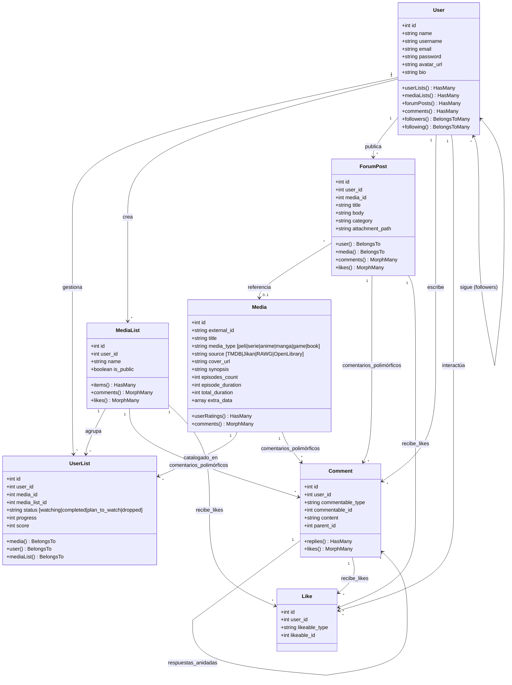
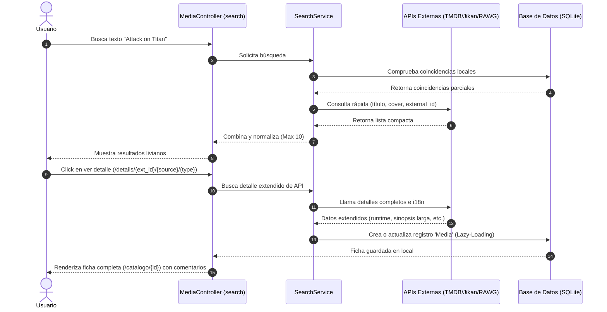

# MyFicList - Visión General de la Aplicación

## 1. Propósito General
**MyFicList** es una sofisticada plataforma web basada en Laravel 12 concebida como un buscador unificado, biblioteca personal y red social para amantes del entretenimiento. Permite a los usuarios descubrir, catalogar, puntuar e interactuar sobre seis categorías principales de contenido:

- **Anime** (Fuente: Jikan / TMDB)
- **Manga** (Fuente: Jikan)
- **Películas** (`peli`) (Fuente: TMDB)
- **Series de TV** (`serie`) (Fuente: TMDB)
- **Videojuegos** (`game`) (Fuente: RAWG)
- **Libros y Novelas** (`book`) (Fuente: Open Library)

La aplicación implementa una arquitectura híbrida de datos: consume APIs externas en tiempo real para búsquedas instantáneas y livianas, e importa de forma diferida (*on-demand*) los detalles a la base de datos local SQLite cuando el usuario interactúa con la ficha o decide catalogar una obra en su colección.

---

## 2. Arquitectura de Base de Datos y Modelo de Dominio
El proyecto utiliza una base de datos **SQLite** por defecto (`database/database.sqlite`) para garantizar la máxima portabilidad, facilidad de instalación en entornos limpios y un gran rendimiento de lectura en consultas locales.

### 2.1 Modelos y Relaciones
La lógica de negocio está estructurada en 7 modelos de Eloquent fuertemente interconectados:

1. **`User`**: Representa al usuario de la plataforma. Cuenta con gestión independiente de avatar, biografía, nombres de usuario únicos para rutas amigables (`/u/{username}`) y relaciones de seguimiento (N a N en la misma tabla mediante la relación `followers` / `following`).
2. **`Media`**: Entidad que almacena la información base normalizada de una obra (película, serie, anime, etc.). Cuenta con campos detallados de duración, recuento de episodios y metadatos complementarios en formato JSON (`extra_data`).
3. **`UserList`**: Tabla intermedia con atributos de seguimiento de estado (`watching`, `completed`, `plan_to_watch`, `dropped`), progreso de visualización/lectura y puntuación de 1 a 10 dada por el usuario. Se asocia opcionalmente a una lista personalizada.
4. **`MediaList`**: Listas personalizadas o carpetas que los usuarios crean para coleccionar obras libremente (ej. *"Mis películas favoritas de terror"*). Poseen configuración de privacidad (`is_public`).
5. **`ForumPost`**: Publicaciones del foro de comunidad. Permiten vincular opcionalmente una obra (`media_id`), categorizar la discusión y adjuntar archivos de soporte.
6. **`Comment` (Polimórfico y Anidado)**: Sistema unificado de comentarios que puede asociarse a una obra (`Media`), a una publicación del foro (`ForumPost`) o a una lista personalizada (`MediaList`). Permite respuestas infinitas en cascada gracias a la autorreferencia `parent_id`.
7. **`Like` (Polimórfico)**: Gestiona las reacciones del usuario. Permite dar "Me gusta" a publicaciones de foro, comentarios y listas personalizadas.

---

## 3. Flujo Principal de Datos y Rendimiento
Para evitar el colapso por consultas repetitivas de API externa y optimizar el almacenamiento, MyFicList sigue un flujo desacoplado:

1. **Búsqueda Instantánea y Liviana**: El `SearchService` consulta primero coincidencias locales y posteriormente las APIs externas. Retorna una estructura unificada muy ligera (sólo `external_id`, `title`, `cover_url`, `media_type` y `source`).
2. **Importación bajo demanda (Lazy Detail)**: Cuando el usuario entra en el detalle de un resultado (`/details/{external_id}/{source}/{type}`), la aplicación obtiene asíncronamente los datos de duración detallada, sinopsis en el idioma correspondiente y elenco. En ese momento se inserta o actualiza el registro en la tabla `media` de la base de datos local y se le redirige a su ficha permanente `/catalogo/{id}`.
3. **Exploración por Scroll Infinito (`/explorar`)**: La vista de exploración carga dinámicamente solo las obras que ya han sido importadas en la base de datos local, aplicando paginación para evitar duplicidades e implementando filtros avanzados por categoría y valoración.

---

## 4. Estructura de Rutas y Controladores

La plataforma divide sus rutas en áreas públicas de comunidad y exploración, y áreas privadas protegidas por autenticación (`middleware: auth`):

### 4.1 Rutas Públicas (Descubrimiento y Comunidad)
- `GET /` (`home`): Pantalla de inicio con el motor de búsqueda global.
- `GET /search` (`media.search`): Procesa y renderiza las búsquedas rápidas.
- `GET /search/unified` (`media.search.unified`): Lanza la búsqueda cruzada entre APIs externas.
- `GET /media/suggestions` (`media.suggestions`): Autocompletado rápido para el buscador.
- `GET /top` (`dashboard`): Vista administrada por `PopularMediaController` que muestra el "FicTop" con los contenidos mejor valorados por categoría.
- `GET /explorar` (`media.explore`): Catálogo de exploración general con scroll dinámico gestionado por `ExploreController`.
- `GET /catalogo/{id}` (`media.show`): Ficha de la obra con detalles completos, puntuación media de la comunidad y comentarios.
- `GET /details/{ext_id}/{source}/{type}` (`media.details`): Endpoint de resolución diferida para importar metadatos antes de renderizar la ficha local.
- `GET /comunidad` (`users.index`): Directorio público de usuarios de la comunidad.
- `GET /u/{user}` (`users.show`): Perfil del usuario, su biografía, seguidores, seguidos, listas personalizadas y actividad de foro.
- `GET /foro` (`forum.index`): Índice general de debates públicos categorizados.
- `GET /listas/{mediaList}` (`media-lists.show`): Renderiza las listas personalizadas que hayan sido configuradas como públicas.

### 4.2 Rutas Privadas (Lógica de Usuario e Interactividad)
*Requieren sesión activa:*
- **Mi Colección**:
  - `GET /mi-lista` (`user-list.index`): El panel central del usuario para administrar su colección personal, filtrada por el estado de las obras.
  - `POST /user-list`, `PUT /user-list/{id}`, `DELETE /user-list/{id}`: Endpoints de gestión de la colección (crear seguimiento, añadir progreso, puntuar u omitir).
- **Importaciones**:
  - `POST /media/import` (`media.add-from-search`): Importación manual a demanda de una obra desde las búsquedas.
- **Foro**:
  - `POST /foro`, `DELETE /foro/{post}`: Publicación y borrado de hilos de discusión.
- **Comentarios**:
  - `POST /comments`, `DELETE /comments/{id}`: Envío de comentarios (y respuestas anidadas) y eliminación de los mismos.
- **Likes**:
  - `POST /like` (`like.toggle`): Alternar "Me gusta" de forma polimórfica.
- **Listas personalizadas**:
  - `POST /media-lists`, `PUT /media-lists/{list}`, `DELETE /media-lists/{list}`: CRUD de carpetas de colección con control de privacidad.
- **Seguidores**:
  - `POST /u/{user}/follow` (`users.follow`): Seguir o dejar de seguir a otro miembro.
- **Ajustes de Perfil**:
  - `GET/PATCH/DELETE /profile`: Edición del perfil de usuario y desvinculación (con subida aislada de avatars al almacenamiento local o nubes S3).

---

## 5. Sistema de Autenticación y Localización (Español)
Para ofrecer una experiencia completamente localizada y profesional a los usuarios hispanohablantes, la plataforma implementa una traducción nativa e integral de los flujos de cuenta:
- **Correos Electrónicos Transaccionales**: Las notificaciones y plantillas de correo para la **verificación de cuenta** y el **restablecimiento de contraseña** han sido completamente traducidas al español mediante diccionarios en JSON (`lang/es.json`).
- **Mensajería del Sistema**: Se han creado archivos de traducción específicos (`lang/es/auth.php` y `lang/es/passwords.php`) que manejan con naturalidad los estados de error de inicio de sesión, bloqueos de seguridad y el proceso de recuperación de contraseñas.
- **Configuración del Framework**: La aplicación establece el español (`es`) como el idioma predeterminado y de respaldo en el archivo de entorno `.env` de manera global.

---

## 6. Resumen
MyFicList combina eficientemente la riqueza de catálogos internacionales (gracias al consumo optimizado y diferido de APIs como TMDB, Jikan y RAWG) con una base de datos local SQLite y una potente red social interactiva. Sus sistemas de relaciones polimórficas (comentarios, likes) y su arquitectura desacoplada garantizan una experiencia fluida, rápida y moderna para el usuario, manteniendo la base de datos limpia de peticiones redundantes.
